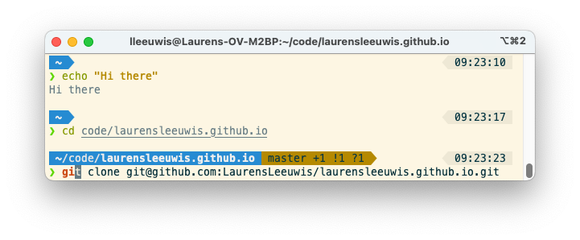

# State of the apps 2023

This is a list of the applications I've installed on my Mac. Very useful as reference for myself once I need to reinstall all of it. Could be useful for you as well, just like the inspiration for this - [State of the apps 2018 by jqno](https://jqno.nl/post/2018/10/07/state-of-the-apps/) - was very useful for me.

## Development

- [Jetbrains Toolbox](https://www.jetbrains.com/toolbox/) is a nice tool to install IntelliJ IDEA. If new versions comes out it's very easy to update, and it gives me a nice menu in the toolbar which makes it convenient to open recent projects.
	- [IntelliJ IDEA Ultimate](https://www.jetbrains.com/idea) is my IDE of choice. I've used it for many years and feel most productive using it.
	    - [Presentation Assistant Plugin](https://plugins.jetbrains.com/plugin/7345-presentation-assistant) I always have this plugin enabled. It shows me which shortcuts I could've used instead of using my mouse. It is also useful during presentations and pair programming; the audience can follow what keys you've pressed. Also, it gives me quick feedback that I actually used the intended shortcut.
	    - [Solarized (light) theme](https://plugins.jetbrains.com/plugin/12784-solarized-themes). Because I'm using the solarized theme for iTerm (see later on) I use the solarized (light) theme for IntelliJ as well. Of course I'm using the same shell (zsh) inside and outside of IntelliJ.
 	    - I disabled tabs. I use CMD+E [a lot](https://twitter.com/LaurensLeeuwis/status/701779865813524480).
 	    - I enabled font ligatures, which gives me amazing `=>` and `!=`'s. I use the defaul JetBrains Mono font nowadays.
- [Brew](https://brew.sh/) to easily install some tools
	- `git` for obvious reasons. The latest version, so not the old version which is installed by default on MacOS
	- `bat` which is like `cat`, but with syntax highlighting.
	- `node` nodeJS (which includes `npm` as well).
	- `tldr` which is like `man`, but more useful.
	- `maven` the build tool for my current project.
	- `joplin` Joplin](https://joplinapp.org/) is a 'Evernote'-like app, which works with Markdown and WebDav. (via `brew install --cask joplin`).
	- `dozer` which helps me hide unused icons in my menu bar. (via `brew install --cask dozer`).
	- `iterm2` as my terminal (see below).  (via `brew install --cask iterm2`).
	- `macdown` [MacDown](https://macdown.uranusjr.com/) to write markdown. I wrote this post using it.  (via `brew install --cask macdown`).
	- `adobe-acrobat-reader` to read (and sign!) PDFs.  (via `brew install --cask adobe-acrobat-reader`).
	- `vlc` [VLC](https://www.videolan.org/) is a nice tool to play all media with. (via `brew install --cask vlc`)
- [iTerm2](https://www.iterm2.com/). Used it for years. Tried [Warp](https://www.warp.dev/) for a while, but couldn't get used to it. Also, I like that iTerm2 kind of behaves the same way as the terminal in IntelliJ, which I use a lot as well.
	- I set up iTerm2 + Oh My Zsh + Solarized light + Powerlevel10k via [this guide](https://gist.github.com/kevin-smets/8568070). It installs a nice font for iTerm2 as well. However, I did set the wizard for Powerlevel10k on my IntelliJ shell, because that doesn't support this nice font :(.
	- I've enabled the `git`, `zsh-autosuggestions` and `zsh-syntax-highlighting` plugins.
	- I've set `HISTSIZE` and `SAVEHIST` to `10000000`
	- This is how it looks: 
- [Docker](https://hub.docker.com/editions/community/docker-ce-desktop-mac). ([Docker Docker Docker!](https://youtu.be/5JMK8vaGxyI?list=PLpQuPreMkT6ArrW7WOI5PhQhBMQNGfPXr&t=95)) I tried installing this via brew, but weirdly that didn't really work. Installed it via the `.dmg`.
- [Boop](https://boop.okat.best/) is an easy to use tool which can format and minify JSON/XML, URL encode/decode, etc.
- [SDKman](https://sdkman.io/) to manage jdks. E.g. `sdk install java 11.0.18-tem` to install the currently latest Java 11 Temurin runtime.

## Tools

- [MacPass](https://macpassapp.org/) to save and generate all my passwords. My go-to 'KeePass compatible' app for the Mac. I use KeePass itself on my Windows machines and [KeePass Touch](https://itunes.apple.com/nl/app/keepass-touch/id966759076) on my iOS device. What I like about KeePass is that I feel that I'm in control over my secret stuff. No company (which can be hacked) keeping track of my passwords.
- [STACK](https://www.transip.nl/stack/) as my cloud storage. I like that it's hosted in the Netherlands, and I got 1TB of storage (which was once free).
- [Scroll reverser](https://pilotmoon.com/scrollreverser/). Usually I use my MacBook with an external (Windows) keyboard, external monitor and external mouse. I like to have my scroll wheel on my mouse work like I'm used to (the Windows default, what MacOS calls not natural) and my touchpad like I'm used to as well (what MacOS calls natural). Scroll reverser lets me actually set this up like I want to.
- [Aerial screensaver](https://github.com/JohnCoates/Aerial) as mentioned before I use my MacBook with an external monitor. If I lock my MacBook, the external screen will go into sleep. It doesn't wake up correctly without switching it on and off again. Bummer. Therefore I always lock it with a screensaver; that way the external monitor won't sleep. I really like the Aerial screensaver, which often shows Hong Kong where I have some fond memories of ;). I also set up a hot-corner to easily put my machine on screensaver mode.
- [Magnet](https://magnet.crowdcafe.com) which adds hotkeys for me to put the windows where I want them. 
- [Alfred](https://www.alfredapp.com/) which is a powerful replacement for Spotlight. I'm just getting started with this tool, there is a lot to learn. I use the [bookmark magic](https://medium.com/@jhkuperus/bookmark-magic-with-alfred-personal-productivity-45d952dad438) a lot. Also, the [Jetbrains Open Project](https://github.com/bchatard/alfred-jetbrains#readme) plugin is really time-saving for me.
- [Contexts](https://contexts.co/) to change the cmd+tab behavior on my mac. When using my Macbook in laptop mode (without external screens) I tend to use this shortcut a lot, and this makes it more like it was in windows. So a single shortcut for all, not cmd+tab and cmd+backtick for switching apps/windows. It did come with some weird window overlayed and always taking space. I made sure to switch that off.
- [Spotify](https://www.spotify.com/us/download/mac/) is making sure I have nice tunes. I'm one of the very late adopters; it's amazing ;).
- [Hex Fiend](https://hexfiend.com/) to open and edit files with a Hex Editor
- [Commander One](https://apps.apple.com/nl/app/commander-one-file-manager/id1035236694) which is like 'Norton Commander' for MacOS. I use this to clean up my machine once in a while. And I really dislike 'Finder'.
- [MacDown](https://macdown.uranusjr.com/) to write markdown. I wrote this post using it.
- [Google Chrome](https://www.google.com/chrome/) is my browser of choice. It syncs my history, bookmarks and some passwords between devices as well. I also know my way around in the developer tools, more than those of the other browsers.
- Microsoft Office. My company uses Office, which I've always used in school, university and at work before as well. I know my way around in Outlook, Word, Excel, Powerpoint and Skype. Because I'm productive in these tools I quite like them as well. I removed Pages, Keynote and Numbers from my machine because they feel obsolete. Actually I have a license for Office at home as well (thanks [HUP](https://www.microsofthup.com)).
- Microsoft Teams is the chat/video conference app we use in our company.
- Of course I have installed some company stuff as well, like Cisco AnyConnect, Sophos Endpoint, etc. etc.

## Things I still miss from my Windows era

- [Workrave](http://www.workrave.org/)/[Workpace](http://www.workpace.com/workpace/about/what-is-workpace/). This helps preventing RSI. While I generally don't like to be disturbed by microbreaks, I dislike it even more when my back or wrist hurts. I tried [Stretchly](https://hovancik.net/stretchly/) and [TimeOut](https://www.dejal.com/timeout/) but I didn't like those. Especially that they didn't reset their times when I took a break on my own.

## Things that are not supported anymore at the latest MacOS

- [Snappy](https://apps.apple.com/us/app/snappy-snapshots-the-smart-way/id512617038) to easily create screenshots. I'm still looking for a proper replacement.
