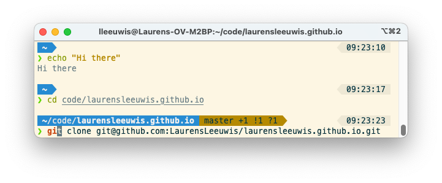

# State of the apps 2026

This is a list of the applications I've installed on my Mac. Very useful as reference for myself once I need to reinstall all of it. Could be useful for you as well, just like the inspiration for this - [State of the apps 2018 by jqno](https://jqno.nl/post/2018/10/07/state-of-the-apps/) - was very useful for me.

## Development

- [Jetbrains Toolbox](https://www.jetbrains.com/toolbox/) is a nice tool to install IntelliJ IDEA. If new versions comes out it's very easy to update, and it gives me a nice menu in the toolbar which makes it convenient to open recent projects.
  - [IntelliJ IDEA Ultimate](https://www.jetbrains.com/idea) is my IDE of choice. I've used it for many years and feel most productive using it.
    - First thing I do is disable tabs. I use CMD+E [a lot](https://twitter.com/LaurensLeeuwis/status/701779865813524480).
    - Next is fixing the keyboard shortcut conflicts 🙄. Go to MacOS system settings -> Keyboard -> Keyboard Shortcuts -> [{Services -> Search man Page Index in Terminal}, {Services -> Open man Page Index in Terminal}, {Mission Control -> Mission Control -> Move left a space}, {Mission Control -> Mission Control -> Move right a space}\]
    - I enabled font ligatures, which gives me amazing `=>` and `!=`'s. I use the defaul JetBrains Mono font nowadays.
    - Presentation assistant: this used to be a plugin but is built-in now. It shows me which shortcuts I could've used instead of using my mouse. It is also useful during presentations and pair programming; the audience can follow what keys you've pressed. Also, it gives me quick feedback that I actually used the intended shortcut.
    - [Solarized theme](https://plugins.jetbrains.com/plugin/12112-solarized-theme). Because I'm using the solarized theme for iTerm (see later on), I use the solarized (light) theme for IntelliJ as well. Of course I'm using the same shell (zsh) inside and outside of IntelliJ. I used a different Solarized theme before, so I'm still getting used to the colours a bit.
- [Brew](https://brew.sh/) to easily install some tools
  - `git` for obvious reasons. The latest version, so not the old version which is installed by default on MacOS
  - `bat` which is like `cat`, but with syntax highlighting.
  - `node` nodeJS (which includes `npm` as well).
  - `tldr` which is like `man`, but more useful.
  - `maven` the build tool for my current project.
  - `joplin` Joplin](https://joplinapp.org/) is a 'Evernote'-like app, which works with Markdown and WebDav. (via `brew install --cask joplin`).
  - `scroll-reverser` [Scroll reverser](https://pilotmoon.com/scrollreverser/). Usually I use my MacBook with an external (Windows) keyboard, external monitor and external mouse. I like to have my scroll wheel on my mouse work like I'm used to (the Windows default, what MacOS calls not natural) and my touchpad like I'm used to as well (what MacOS calls natural). Scroll reverser lets me actually set this up like I want to.
  - `iterm2` as my terminal (see below). (via `brew install --cask iterm2`).
  - `adobe-acrobat-reader` to read (and sign!) PDFs. (via `brew install --cask adobe-acrobat-reader`).
  - `vlc` [VLC](https://www.videolan.org/) is a nice tool to play all media with. (via `brew install --cask vlc`)
  - `ret` [RET](https://github.com/rabobank/ret-engineering-tools). Very nice when using Azure DevOps to quickly create pull requests. `brew tap rabobank/tap` and `brew install ret` does the trick (and then configuring autocomplete). And I use the [git plugin](https://github.com/rabobank/ret-plugins?tab=readme-ov-file#git-plugin) (to `ret git pr create`)
- [iTerm2](https://www.iterm2.com/). Used it for years. Tried [Warp](https://www.warp.dev/) for a while, but couldn't get used to it. Also, I like that iTerm2 kind of behaves the same way as the terminal in IntelliJ, which I use a lot as well.
  - Installed via Brew (see above)
  - I set up iTerm2 + Oh My Zsh + Solarized light + Powerlevel10k via [this guide](https://gist.github.com/kevin-smets/8568070). It installs a nice font for iTerm2 as well.
  - I've enabled the `git` plugin.
  - I've set `HISTSIZE` and `SAVEHIST` to `10000000`
  - This is how it looks: 
- [Docker](https://hub.docker.com/editions/community/docker-ce-desktop-mac). ([Docker Docker Docker!](https://youtu.be/5JMK8vaGxyI?list=PLpQuPreMkT6ArrW7WOI5PhQhBMQNGfPXr&t=95)) I tried installing this via brew, but weirdly that didn't really work. Installed it via the `.dmg`.
- [Boop](https://boop.okat.best/) is an easy to use tool which can format and minify JSON/XML, URL encode/decode, etc.
- [SDKman](https://sdkman.io/) to manage jdks. E.g. `sdk install java 25.0.2-tem` to install the currently latest Java 25 Temurin runtime.

## Tools

- [Brave](https://brave.com/download/) is my browser of choice. It syncs my history and bookmarks between devices as well. I don't use it for passwords
- [Alfred](https://www.alfredapp.com/) which is a powerful replacement for Spotlight. After using this for years, there is still a lot to learn. I use the [bookmark magic](https://medium.com/@jhkuperus/bookmark-magic-with-alfred-personal-productivity-45d952dad438) a lot. Also, the [Jetbrains Open Project](https://github.com/bchatard/alfred-jetbrains#readme) plugin is really time-saving for me.
- [Magnet](https://magnet.crowdcafe.com) which adds hotkeys for me to put the windows where I want them. 
- [Contexts](https://contexts.co/) to change the cmd+tab behavior on my mac. When using my Macbook in laptop mode (without external screens) I tend to use this shortcut a lot, and this makes it more like it was in windows. So a single shortcut for all, not cmd+tab and cmd+backtick for switching apps/windows. It did come with some weird window overlayed and always taking space. I made sure to switch that off.
- [MacPass](https://macpassapp.org/) to save and generate all my passwords. My go-to 'KeePass compatible' app for the Mac. I use KeePass itself on my Windows machines and [KeePass Touch](https://itunes.apple.com/nl/app/keepass-touch/id966759076) on my iOS device. What I like about KeePass is that I feel that I'm in control over my secret stuff. No company (which can be hacked) keeping track of my passwords.
- [OneDrive](https://onedrive.live.com/login) as my cloud storage. I used STACK before, which I liked because it was hosted in the Netherlands. And then they increased their prices massively. I'm now on a family plan with OneDrive, so also my family members can benefit.
- [Aerial screensaver](https://github.com/JohnCoates/Aerial) as mentioned before I use my MacBook with an external monitor. If I lock my MacBook, the external screen will go into sleep. It doesn't wake up correctly without switching it on and off again. Bummer. Therefore I always lock it with a screensaver; that way the external monitor won't sleep. I really like the Aerial screensaver, which often shows Hong Kong where I have some fond memories of ;). I also set up a hot-corner to easily put my machine on screensaver mode.
- [Spotify](https://www.spotify.com/us/download/mac/) is making sure I have nice tunes. I'm one of the very late adopters; it's amazing ;).
- [Hex Fiend](https://hexfiend.com/) to open and edit files with a Hex Editor
- [Commander One](https://apps.apple.com/nl/app/commander-one-file-manager/id1035236694) which is like 'Norton Commander' for MacOS. I use this to clean up my machine once in a while. And I really dislike 'Finder'.
- [uFocus](https://desairem.com/wordpress/ufocus/) to write markdown files. I wrote this guide using it.
- Microsoft Office. My company uses Office, which I've always used in school, university and at work before as well. I know my way around in Outlook, Word, Excel, Powerpoint. Because I'm productive in these tools I quite like them as well. I removed Pages, Keynote and Numbers from my machine because they feel obsolete. Actually I have a license for Office at home as well (via OneDrive).
- Microsoft Teams is the chat/video conference app we use in our company.
- Of course I have installed some company stuff as well, like Zscaler 😩, Microsoft Defender, etc. etc.
- [Google Chrome](https://www.google.com/chrome/) to test web apps

## Things I still miss from my Windows era

- [Workrave](http://www.workrave.org/)/[Workpace](http://www.workpace.com/workpace/about/what-is-workpace/). This helps preventing RSI. While I generally don't like to be disturbed by microbreaks, I dislike it even more when my back or wrist hurts. I tried [Stretchly](https://hovancik.net/stretchly/) and [TimeOut](https://www.dejal.com/timeout/) but I didn't like those. Especially that they didn't reset their times when I took a break on my own.

## Things that are not supported anymore at the latest MacOS

- [Snappy](https://apps.apple.com/us/app/snappy-snapshots-the-smart-way/id512617038) to easily create screenshots. I'm still looking for a proper replacement.
- `dozer` which helped me hide unused icons in my menu bar. (via `brew install --cask dozer`).